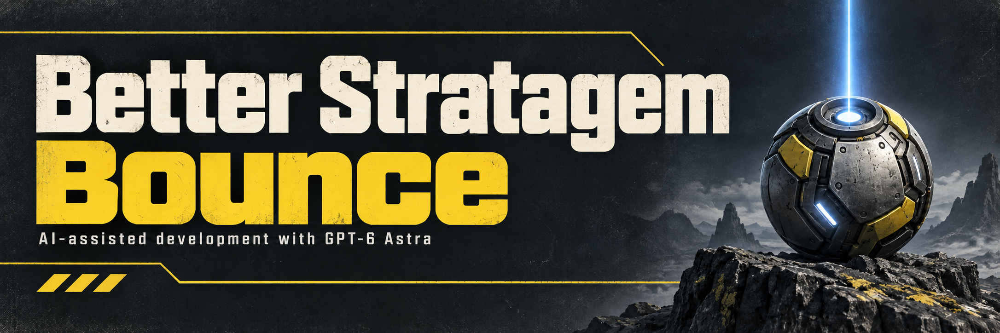

# Better Stratagem Bounce

[Download archive-v15](https://github.com/CowboyBingus/BetterStratagemBounce/releases/tag/archive-v15) · [Required Bingus Shared Loader](https://github.com/CowboyBingus/BingusSharedLoader/releases/tag/loader-v2)

Lets stratagem balls stick and activate on more surfaces instead of bouncing away, including solid ground outside the game's navigation mesh.

**Install:** Close the game, import `BingusSharedLoader.zip` and `BetterStratagemBounce.zip` into **HDArsenal** or **HD2MM**, enable both, and deploy. The loader is a required separate download; managers do not install it automatically. Use one manager. See [upgrading and uninstalling](INSTALL.txt).

This prerelease is **archive-v15**, for Steam build **24826606** / EXE **1.8.45317.0**. It contains only this gameplay module. Bingus Shared Loader owns the startup code, so later loader updates require replacing just the loader package. Other gameplay mods are optional.

Remove older packages with bundled loaders before deploying this candidate. This package requires Bingus Shared Loader loader-v2 / API 1. The loader was formerly named Shared Mod Loader; its manager GUID and API are unchanged. In-game validation of the packaging transition remains pending.

The native slope limit remains about 45.57 degrees. Steep surfaces, vertical walls and undersides still reject the ball. Sticking does not guarantee that every payload can land in every location.

The new gameplay packages and Bingus Shared Loader own distinct resources and do not overlap with each other. The loader preserves Wwise callbacks and does not replace `boot`, allowing the tested HD2 HUD+ 0.1.3 boot script to coexist. Another Wwise replacement can still conflict. See [compatibility](docs/COMPATIBILITY.md).

## Source

- `src/`: runtime Lua modules.
- `tests/`: synthetic memory, callback and package checks.
- `scripts/`: dependency setup, build, packaging and optional Arsenal validation.
- `cmd/`: tools for extracting and inspecting game resources.
- `assets/`: README banner and Arsenal thumbnail.

[Build from source](CONTRIBUTING.md) · [Technical walkthrough](docs/TECHNICAL.md) · [Third-party dependencies](THIRD_PARTY.md)

**AI disclosure:** GPT-6 Astra was used for research, implementation, debugging, documentation and artwork.

[Release notes](docs/RELEASE_NOTES.md) · [Artwork](assets/ARTWORK.md)
